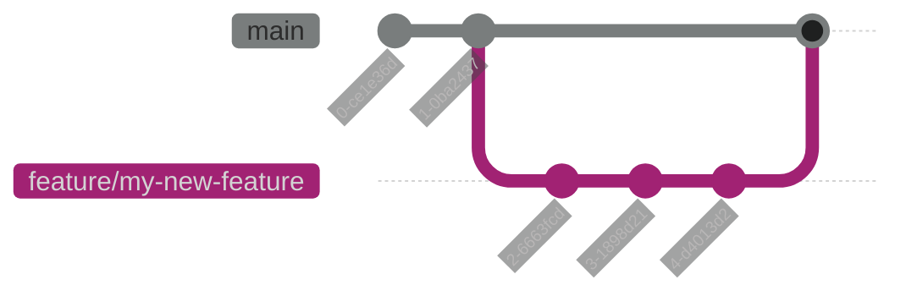

---
authors:

- "ernail"
date: 2025-08-19
---

# Day Zero: Setting Up Your IT Projects for Success

During the last few years, I have seen many IT projects descend into chaos.
Technical debt was building more and more, maintainability was decreasing further and further,
processes were overengineered and knowledge silos were building.

There are many reasons for these symptoms.
But one I found often overlooked is the first setup, the foundation for the project.
To me it often seems like teams just get together and start writing code,
without ever answering fundamental questions on how to work together:
Which Git workflow should we use? Should we enforce code reviews? Do we use linters and formatters?
How and where do we write documentation? Should we automate releases? How do we keep dependencies up-to-date?
What should be part of our CI/CD processes? Do we use Monorepos? How do we share knowledge?

<!-- more -->

In the following sections, I will introduce essential concepts and my opinion on how IT projects should be set up.
As always in the IT world, there is no single truth. Each decision has trade-offs, and depending on your or your team's
priorities, you may want to make different decisions. To have a baseline, my assumption for the following decisions is:

- We want to build **reliable, secure and maintainable** software and/or infrastructure
- We want to achieve a **high standard** in what we are building
- We want to **reduce** the amount of **manual work**
- We want to keep manual work as **simple and efficient** as possible
- When we break things, we want to be able to **quickly recover and debug issues**

The order of topics is somewhat random. Most topics more or less relate to each other,
but each section can be read independently.

## Self-Contained Teams

Splitting teams by technical expertise often leads to the same issues:

- Communication overhead: Work must be passed between teams, which creates delays and miscommunication
- Blame games and finger-pointing: When things break, teams point to each other and no one takes responsibility
- Knowledge silos: Each team only understands their piece, which makes troubleshooting difficult
- Lack of ownership: No single team feels responsible for what's delivered

That's why concepts like DevOps have formed.
Ideally, a team has as few dependencies and as much responsibility as possible.
It is always more efficient when a team is able to immediately start working on new features or fixing bugs,
without needing to communicate with or wait for another team.

> But where do you draw the line? Should we not use AWS because it introduces a dependency?
> Should we not use the company's GitLab instance but host our own?

My answer is relatively simple:
If the team has the technical skill and it will be more efficient to avoid the dependency
while still fulfilling all requirements, you should do so.

TLDR: Keep your team as self-contained as possible, avoid dependencies on other teams as much as possible.

## Git Workflow

Your team will be working with Git, so it's important to make a decision on how to work with Git.

Most of the time, teams will default to the ["Git Flow"](https://nvie.com/posts/a-successful-git-branching-model/).
However, if you spend just a few minutes reading up on this workflow, you will see sentences like:

> If your team is doing continuous delivery of software,
> I would suggest to adopt a much simpler workflow instead of trying to shoehorn git-flow into your team.
>
> -- [Vincent Driessen](https://nvie.com/posts/a-successful-git-branching-model/), creator of the Git Flow
>
> Gitflow is a legacy Git workflow that was originally a disruptive and novel strategy for managing Git branches.
> Gitflow has fallen in popularity in favor of trunk-based workflows,
> which are now considered best practices for modern continuous software development and DevOps practices.
> Gitflow also can be challenging to use with CI/CD.
>
> -- [Atlassian](https://www.atlassian.com/git/tutorials/comparing-workflows/gitflow-workflow)

In my opinion, no matter which topic: Start with something simple, and make it more complex if you really need it.
I would recommend
[Scaled Trunk-Based Development](https://trunkbaseddevelopment.com/#trunk-based-development-for-smaller-teams)
or the [GitHub Flow](https://docs.github.com/en/get-started/using-github/github-flow).
The basic principle is that there is only one persistent branch. Every other branch is short-lived and only exists
until it is merged to the default branch.

TLDR: Keep things simple, use GitHub Flow or Scaled Trunk-Based Development.

## Deployment Strategy

> But how would I deploy to my `development` environment without a `dev` branch?
> Or to my `test` environment without a `test` branch?

First off, we need to assume that the different branches don't have entirely different code bases.
This is not the use-case of branches, there should always be points in time where branches are exactly the same.

There are various options for deployment, all with different trade-offs.
I will compare these in detail in another blog post. For now I will just give my personal preference:

In my opinion, the default branch should always be in a deployable state.
So before a change is merged to the default branch,
it must be reviewed, deployed to non-production environments and tested.
Relating to the Git Workflow, this would mean that team members would deploy to non-production environments
from their own non-default branches, while the deployment to all environments happens from the default branch.

With this, we get the following benefits:

- Changes can be tested and deployed in isolation from other changes
- Changes are released and/or deployed often
- Every change affecting production environments is reviewed and tested

The drawback here is that team members can overwrite each other's non-production deployments from different branches.
In my experience, this was never an issue.
First, at least two people need to work in the same repository at approximately the same time.
Then, they both need to trigger deployments to the same environment at approximately the same time.
Even if this happens, one of them will recognize that another team member deployed changes,
so they can communicate and decide how to continue. Decide who deploys first and simply redeploy?
Work on the same branch?
In my opinion, being able to deploy changes in isolation and keeping the deployment risk as low as possible is worth
the non-risk of sometimes having to deal with redeployments in non-production environments.

TLDR: Choose a strategy that keeps things simple and the deployment risk low.

## Code Reviews

One important process for ensuring quality and sharing knowledge is code reviews.

In my opinion, they should be enforced for every single repository the team creates.
To enforce them, pushing to the default branch should be forbidden, so changes need to go through a pull/merge request.
The pull/merge request should require at least one other team member to review the changes before they are merged.

This way, team members can learn from each other, more opinions often lead to more thought-through solutions,
and at least one other person knows about the changes.

> But won't this slow down development?

In the short-term: A bit. In the long-term: No.
In the end, the chance of broken, unreadable, unmaintainable or overengineered code
becoming part of the production codebase is greatly reduced.
Technical debt and the need to refactor the code will build up much slower.
In addition, you will have more team members who are able to adapt the code if needed.

> But code reviews take forever, which leads to features not being merged

This usually points to other issues. I would suggest keeping the changes for a single code review as small as possible.
Furthermore, I would suggest performing synchronous reviews.
The team member creating the pull/merge request should call/meet another team member before working on another task,
so they can talk about the changes and get things merged faster.
Also, CI/CD Pipelines should take care of formatting, linting, testing, and so on,
which will save a lot of time during the review.

> But is this really needed if the changes have no relevance for anything running in production?

If there are things that have absolutely zero relevance for anything running in production,
they probably should not exist.

Let me give you an example: Should there be a code review if you adapt the infrastructure of a staging environment?
In the end, you don't change the production environment, so why not just skip the code review?
Because the change can still affect the production environment.
Your staging environment has changed, so now it might behave differently from the production environment,
so now things might work in your staging environment, but not in your production environment.
With a code review, at least one other person knows about the change which caused the environments to be too different,
and the issue might even have been prevented.

My point is that almost everything can have an indirect effect on things in production.
And if something really has no effect, does it really need to exist?

TLDR: Enforce code reviews for every single change in every repository.

## Linters and Formatters

It's impossible to remember all best practices of a language. Tools called "linters" can check your code automatically
for common issues, style violations, potential bugs, and security issues.
Similarly, "formatters" can automatically fix code style and ensure consistent formatting across your entire codebase.

Setting up linters and formatters prevents discussions about code style during code reviews.
Instead of arguing whether to use tabs or spaces, your team can focus on the actual logic and design of the code.

Linters and formatters should not only run locally on the developers machine.
Simply because there is no way to enforce their usage.
That's why they should be part of your CI/CD processes.

TLDR: Set up linters and formatters early and enforce them in CI/CD processes.

## CI/CD

CI/CD processes are another essential tool
for ensuring quality and maintainability while reducing manual effort.

In the end, every step in the software lifecycle that can be automated, should be automated:

- Check the linting and formatting of the changes
- Test the changes
- Build the packages/binaries/images
- Publish the packages/binaries/images
- Publish the changelog and/or create releases (e.g. GitHub Releases, GitLab Releases)
- Deploy the changes

Performing these checks on every code change ensures that certain requirements are always fulfilled.
Furthermore, a lot of time is saved by not manually performing all these steps during code reviews.

TLDR: Automate everything you can in your software lifecycle and run it continuously.

## Release Automation

In the last few years, I have seen a lot of processes where people manually have to:

- Determine the next version number
- Update the version number in one or more files
- Create a git tag for the current version number
- Update the changelog
- Publish packages/binaries/images
- Create GitHub Releases, GitLab Releases, etc.

This entire process can and should be automated.
Tools like [`semantic-release`](https://github.com/semantic-release/semantic-release) can be set up to run in your
CI/CD processes. They use the [conventional commits](https://www.conventionalcommits.org/en/v1.0.0/)
from your git history to determine the next version number and generate the release notes.

## Commit History

The commit history is an important tool for understanding what changed, when, and why. A clean commit history
makes debugging much easier and helps you understand what changed in a repository.

Unfortunately, many teams end up with commit histories full of messages like "fix", "fix again", "updated stuff", "oops",
and "Merge branch 'feature/xyz' into main". This tells you nothing useful and only makes debugging and understanding
changes harder.

[Conventional Commits](https://www.conventionalcommits.org/en/v1.0.0/) provide a simple convention for commit messages
that makes them human and machine readable. They can be used to automate releases.

I also strongly recommend maintaining a linear commit history without merge commits. Instead of creating merge commits
every time a feature branch is merged, use rebase or fast-forward merges. This makes it easier to follow the
chronological order of changes, simpler to bisect when debugging, and creates a cleaner `git log`.
Pull/Merge requests should be set up to perform fast-forward merges or rebases when merged.

TLDR: Use conventional commits and maintain a linear history through rebasing or fast-forward merges.

## Monorepos

Almost all of the concepts explained in this post become much more complex once you are in a monorepo.
How do you keep a clean commit history that can be used for release automation?
How do you set up release automation for multiple projects that share the same git history?
How do you set up CI/CD pipelines?

In my opinion, this complexity should only be added if there is a valid need to switch to monorepos.
For most teams, separate repositories per project or service will be simpler to manage and follow the principles
outlined in this post more easily.

My preferred way is:
One repository only contains the products/services/libraries i want to release with the same changelog and version.

TLDR: Avoid monorepos unless you have a compelling reason to use them.

## Everything-as-Code

Everything that exists as code can be version-controlled, reviewed, linted and formatted.
This means infrastructure, configuration, and documentation should all be version-controlled,
reviewable, and deployable through the same processes as your application code.

The best known examples are Infrastructure-as-Code and Configuration-as-Code,
with tools like [OpenTofu](https://opentofu.org/) (Open Source Terraform alternative),
[Pulumi](https://www.pulumi.com/) or [Ansible](https://www.ansible.com/).

A lesser-known example is Documentation-as-Code.
If your documentation lives close to your code, in the same repository, the chance of it
staying up-to-date is increased since it's part of the same development workflow.
The documentation will also have higher quality, since it should be reviewed, linted, and formatted.

TLDR: Use Infrastructure-, Configuration-, Documentation-as-Code, etc. to make better use of your workflows.

## Knowledge Sharing

If only one person understands a critical system,
your project becomes fragile and that person becomes a bottleneck.

Code reviews are one of the first steps to prevent knowledge silos. Every change should be reviewed
by at least one other team member, ensuring knowledge spreads across the team.
Documentation-as-Code ensures that important knowledge is written down and maintained.
Pair programming sessions will help to get a deeper understanding of the code.
Writing [Decision Records](https://adr.github.io/) that the team must review can also be a very helpful tool,
with the additional benefit of making transparent why certain choices were made.

> But knowledge sharing takes time away from development work.

In the short-term, yes. But in the long-term, you will save time, since:

- Anyone can fix bugs in any part of the system
- Team members can cover for each other during vacations or departures
- New team members can onboard faster
- Complex systems don't become "black boxes" that nobody dares to touch

TLDR: Actively share knowledge through code reviews, documentation, and regular discussions to prevent silos.

## Dependency Updates

Software dependencies don't maintain themselves. Security vulnerabilities are discovered, bugs are fixed,
and new features are added. That's why they should be updated frequently.
Updating one dependency version is manageable. Updating dozens of dependencies that are years out of date
becomes a major project.

Automated dependency update tools like [Renovate](https://github.com/renovatebot/renovate) can create pull/merge requests
when new versions of your dependencies are available. Combine this with a solid CI/CD process,
and most dependency updates could be applied automatically.

TLDR: Automate dependency updates and apply them frequently to avoid accumulating technical debt and security risks.
