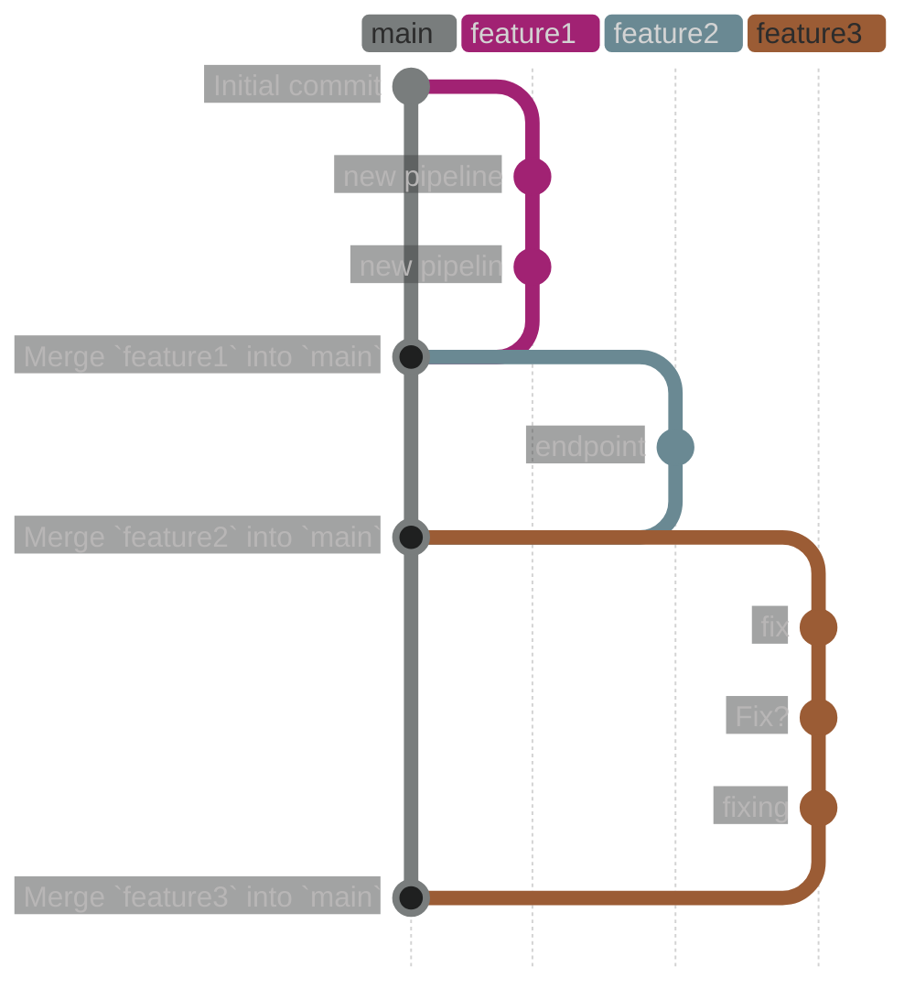
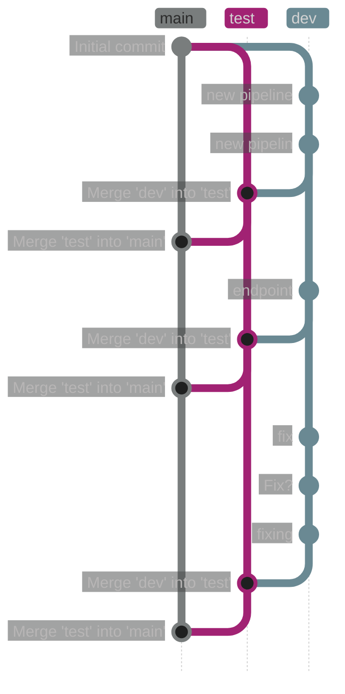
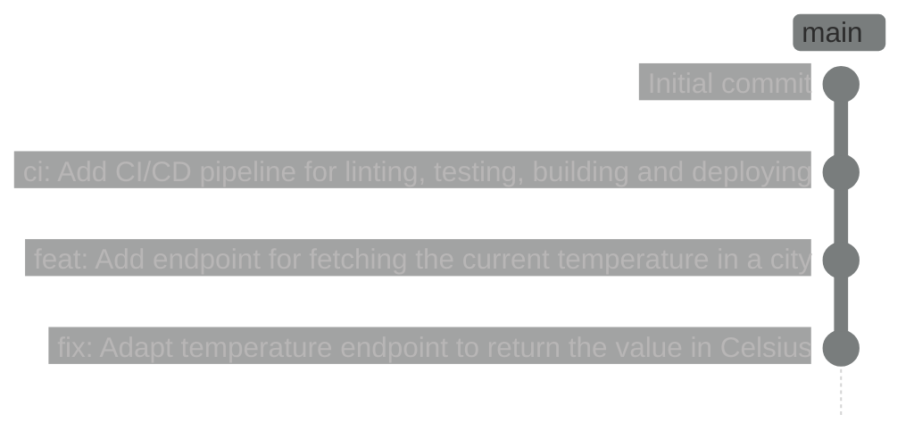
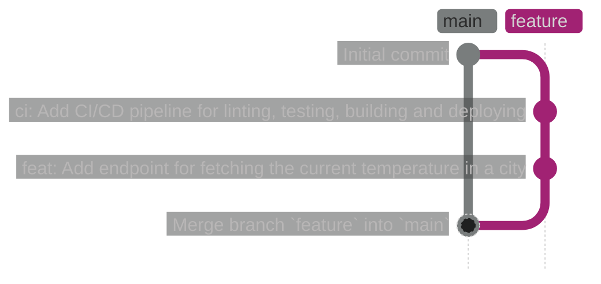
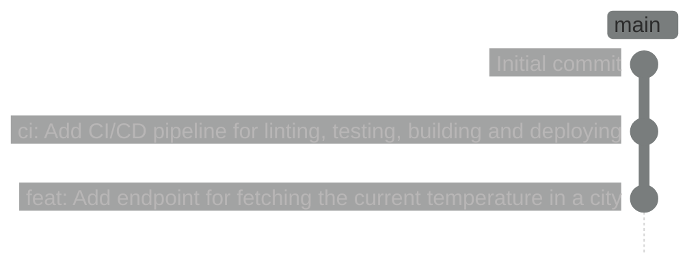
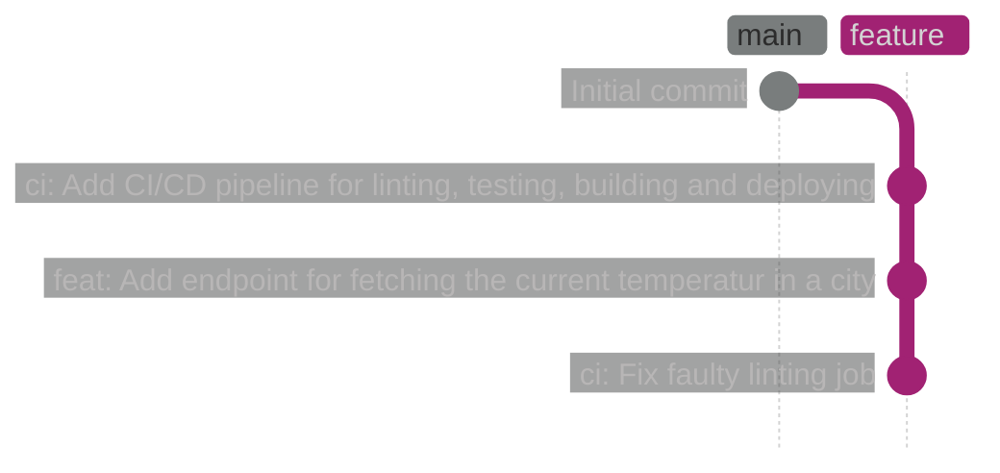
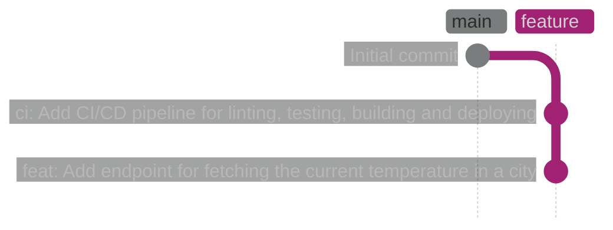
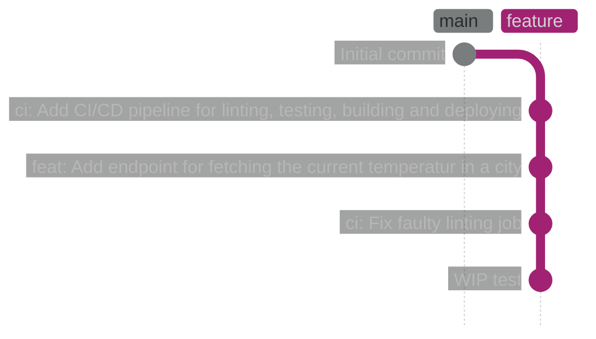
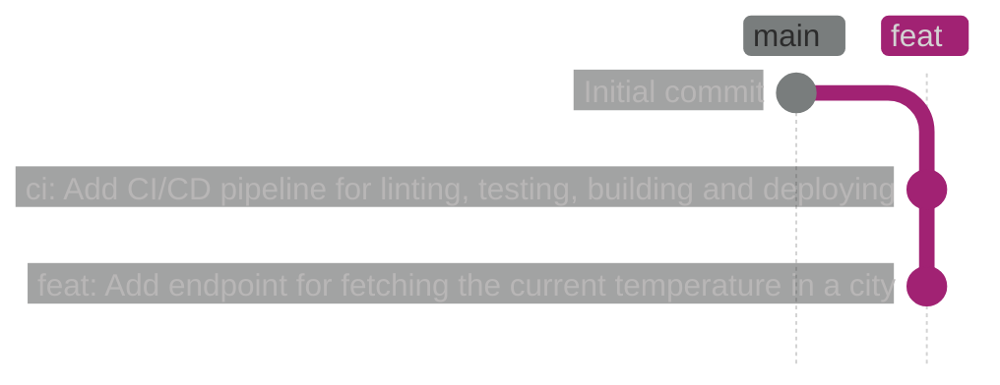

---
authors:
- "ernail"

date: 2026-03-31
---

# Creating Actually Useful Commit Histories

Commit messages and the history they create are important for debugging, collaborating,
and automating processes.

Most enterprise projects I know have a commit history that looks something like this:



Or, if for some reason you still use multiple persistent branches instead of short-lived feature branches:



I have several pain points with these commit histories:

- None of the commit messages are telling you what actually changed, or why it changed
- The history is cluttered with multiple commits trying to add or fix the same thing
- The history is cluttered with merge commits
- The history can't be used to automate processes,
  such as determining the next version number or generating release notes

Let's compare this to a commit history that looks like this:



This commit history is easier to understand, useful for debugging, and can be used for automating processes.

<!-- more -->

> But aren't you just pushing to `main`?

No. This is a commit history which had multiple pull/merge requests merged.
Let's look at how we can create commit histories like this.

## Conventional Commits

[Conventional Commits](https://www.conventionalcommits.org/en/v1.0.0/) are a
"specification for adding human and machine readable meaning to commit messages".
The basic format looks like this:

```text
<type>[optional scope]: <description>
```

For example:

```text
fix(temperature-endpoint): Adapt endpoint to return the value in Celsius
```

The keyword and scope alone already tell you more than any of the commit messages in the examples above.
Just by reading them, you know that there was a bug with the temperature endpoint that was fixed.

Conventional Commits can also be parsed by tools to automate processes.
A good example is release automation.
[`verscout`](https://github.com/erNail/verscout) uses the `<type>` to determine the next version number.
[`git-cliff`](https://github.com/orhun/git-cliff) uses the `<type>` and `[optional scope]` to
categorize changes in release notes.

I would recommend enforcing this commit message format.
Most Git hosting providers repo settings allow you to set up a Regular Expression that commit messages must match.
Or your CI/CD Pipeline could validate new commits and fail if they don't match the format.

## Linear Histories with Rebasing

Most people use merge commits to merge branches.
This creates a lot of clutter in the commit history, without adding much value.

Rebasing allows us to create a linear commit history, without merge commits.
This basically takes all commits from the branch being merged, adding them on top of the target branch.

Here we can see the commands for a simple merge:

```shell
git checkout feature
git commit -m "ci: Add CI/CD pipeline for linting, testing, building and deploying"
git commit -m "feat: Add endpoint for fetching the current temperature in a city"
git checkout main
git merge feature
```

Which produces this result:



With `rebase`, we use the following commands:

```shell
git checkout feature
git commit -m "ci: Add CI/CD pipeline for linting, testing, building and deploying"
git commit -m "feat: Add endpoint for fetching the current temperature in a city"

# Make sure our commits are on top of the latest commits from main
git rebase main

# Rebase our commits on top of main
git checkout main
git rebase feature
```

Which produces this result:



!!! info
    Note that when not deleting the branch `feature`, it will point to the same commit as `main` after the rebase

Most Git hosting providers provide settings to automatically rebase commits when a pull/merge request is merged.
There are also settings for rejecting non-linear commit histories.
Or your CI/CD Pipeline could take care of the validation.

## Editing the History

A lot of people treat the commit history like something immutable. Once a commit exists, it's there forever.
This is not the case. Git provides several commands to edit the history and keep it clean.

!!! warning
    Editing an already pushed history always leads to a force push.
    This is not an issue, as long as you are the only one working on a branch,
    or if your team members know about it.

    I would recommend having one `main` branch no one is allowed to push to.
    All changes on `main` need to come from pull/merge requests.

Let's look at different ways to edit the commit history.

### Amending commits

Let's say we need to push changes to test them, but we need some iterations to get it right.
Instead of creating multiple commits called `fix`, `fix?`, `try fix again`, we can just amend the previous commit:

```shell
# First commit
git add .
git commit -m "ci: Add CI/CD pipeline for linting, testing, building and deploying"
git push

# CI/CD pipeline is not working yet, we need to change something and push again
git add .
git commit --amend --no-edit
git push --force-with-lease
```

Or let's say we find a typo in a commit message after pushing it:

```shell
git add .
git commit -m "ci: Add CI/CD pipline for lnting, tst, building and deployingg"
git push

git commit --amend -m "ci: Add CI/CD pipeline for linting, testing, building and deploying"
git push --force-with-lease
```

In both cases, we are basically fixing faulty commits.
We also don't need to think about new commit messages with every fix we try.
And we have one commit that can be easily reverted if needed.

### Resetting

Using resets, we can throw away a faulty commit history and create a new one.
Let's say we pushed the following:



Let's also imagine that the `feat` commit contains a change to the CI/CD pipeline that was supposed to be part of
another commit.

I want to change three things here:

- The change to the CI/CD pipeline should be part of a `ci` commit.
- There should be only one `ci` commit, since they are related to the same thing, and one commit is just fixing a
  mistake in the first one.
- There should be no typo in the `feat` commit message

We can perform a mixed reset to the `Initial Commit`.

```shell
git switch feature
git reset --mixed HEAD~3
```

Since it's a mixed reset, we will keep all of the changes we already committed.
They will stay in our unstaged changes, and our branch will point to the `Initial Commit`.

Now we can re-stage and re-commit our changes the way we want them:



!!! danger
    Keep in mind that a hard reset will permanently discard all changes. Unlike a mixed reset,
    nothing is preserved. Always double-check you are using `--mixed` or `--soft` (or no flag, since it's the default)
    when you intend to restructure commits.

### Interactive Rebasing: Squashing, Reordering, Dropping

Using interactive rebasing, we can reorder commits, drop commits, and squash multiple commits into one.

Imagine we push the following commits:



I want to make several changes to the commits on the `feature` branch.
To change all 4 commits, the interactive rebase has to start on the `Initial Commit`:

```shell
git switch feature
git rebase -i HEAD~4
```

This will open an editor with the following content:

```text
pick 1234567 ci: Add CI/CD pipeline for linting, testing, building and deploying
pick 2345678 feat: Add endpoint for fetching the current temperatur in a city
pick 3456789 ci: Fix faulty linting job
pick 4567890 WIP test
```

I want to change 3 things here:

- The commit `WIP test` should not exist anymore
- Both `ci` commits should be next to each other, since they are related to the same thing
- There should be no typo in the `feat` commit message

So we change the content to this:

```text
pick 1234567 ci: Add CI/CD pipeline for linting, testing, building and deploying
pick 3456789 ci: Fix faulty linting job
reword 2345678 feat: Add endpoint for fetching the current temperature in a city
drop 4567890 WIP test
```

On second thought, let's squash the `ci` commits together, since they are both related to the same thing,
and the second one is just fixing the first one.

```text
pick 1234567 ci: Add CI/CD pipeline for linting, testing, building and deploying
squash 3456789 ci: Fix faulty linting job
reword 2345678 feat: Add endpoint for fetching the current temperature in a city
drop 4567890 WIP test
```

After saving and closing the editor, we will be prompted to edit the commit message for the squashed commit.
We keep the message of the first commit, and nothing else.

Now we get the following commit history:



!!! info
    Most Git hosting providers also have options to squash all commits of a pull/merge request.
    If you think your changes should be part of a single commit, this is a good option to use.
